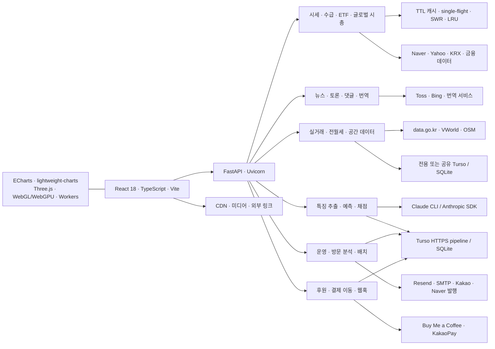

# 시스템 아틀라스

관리자 콘솔의 **시스템 아틀라스** 메뉴 또는 `/admin/system-atlas`에서 열 수 있습니다. 기본 화면은 **ATLAS · 센티널 관제**이며, 전체 구조와 실제 API·외부 HTTP 관측, DB·캐시 상태를 9개 보기에서 탐색합니다. 일반 관리자 세션이 필요하며 기존 뉴런 모니터의 제한된 세션으로는 접근할 수 없습니다.

## 구조 및 데이터 흐름



위 그림은 주요 경로 요약입니다. 페이지의 연결 지도는 실행 중인 FastAPI 라우트와 Python AST의 import·URL·테이블 선언을 바탕으로 만들어집니다. 프런트엔드 패키지, 정적 페이지, Worker 파일, 외부 URL 참조, GitHub Actions 스케줄은 빌드할 때 TypeScript AST 및 설정 파일에서 생성합니다. 링크·리소스 참조와 실제 호출은 구분합니다.

| 영역 | 주요 구현 및 연동 |
|---|---|
| 프런트엔드 | 자체 History API 라우터, React 페이지 단위 코드 분할, 순수 CSS, 가시성 기반 HTTP 폴링 |
| API | FastAPI 라우터, Pydantic, 관리자 인증, GZip, 공개 JSON ETag, 정적 SPA 서빙 |
| 증시 | pandas·numpy 지표 계산, FinanceDataReader, Naver·Yahoo 시세, 수급, ETF, 시장 지도 및 시총 스냅샷 |
| 뉴스·커뮤니티 | requests, BeautifulSoup4·lxml, Toss·Bing·Naver, 번역, 댓글 저장소 |
| 부동산 | 국토교통부 실거래·전월세, VWorld·OSM 공간 데이터, 별도 DB 지원, 수집 대기열·지역별 이력 |
| 예측 | 특징 추출, 정량 엔진, Claude CLI/SDK 분석, 예측 upsert, 후속 채점 및 정기 스케줄 |
| 운영 | 방문·행동·기기 분석, 저장소 게이트, SMTP/Resend, Kakao 알림, Playwright Naver 발행 |
| 후원 | 페이지/클릭 분석, 결제 페이지 이동, 웹훅 처리, 후원자 및 댓글 저장 |
| 저장소 | Turso Hrana `/v2/pipeline` HTTPS 전송, 미설정 시 파일별 SQLite, 부동산 전용 DB 선택 가능 |
| 캐시 | 프로세스 내 TTL 캐시, single-flight, stale-while-revalidate, 최대 20,000 키 |
| 배포 | Docker 다단계 빌드, Render, Node 20 빌드/Python 3.11 런타임, 기본 Uvicorn worker 1개 |

## 화면 사용

- 영역 또는 연결선을 클릭하면 상세 패널에서 연결 미니 지도, API, 모듈 import, 호스트 및 스키마 선언을 탐색합니다.
- API를 클릭하면 실제 요청 표본과 같은 요청에 연결된 외부 HTTP 호출, 정적 모듈 의존성을 함께 확인합니다.
- **API 인벤토리**에서 전체 라우트를 검색합니다. 메서드, 함수, 의존성 및 관측된 평균 지연이 표시됩니다.
- **DB·캐시**에서 캐시 유효/만료 분포와 저장소 게이트의 호출·대기·처리·오류·차단 상태를 확인합니다. 실제 SQL·테이블 조회는 기존 DB 콘솔로 연결됩니다.
- **기술 스택**에서 프로젝트가 선언한 패키지 버전, 배포 정책, 활성 스레드와 관측 범위를 확인합니다.
- 확대/축소, 선택 영역 집중, 전체화면, 이벤트 필터, 관측 일시정지, JSON 스냅샷 다운로드를 지원합니다.
- 실시간 표본은 3초마다, 서버/DB 상태는 15초마다 갱신합니다. 숨겨진 탭에서는 갱신을 멈추고, 요청 중복을 방지합니다. 실패하면 마지막 성공 값과 갱신 실패를 표시합니다.

## 실제 관측 범위

API middleware와 `requests.HTTPAdapter.send`에서 측정합니다. ContextVar로 요청 정보를 전달하여 동기 FastAPI 핸들러의 HTTP 호출도 해당 요청과 연결합니다. 이동 신호는 실제 API 활동 또는 해당 요청에 연결된 외부 HTTP 호출이 있을 때 표시합니다. 요청 없이 실행된 배치의 HTTP 호출은 외부 호스트 집계에 포함되고 API 요청과 연결하지 않습니다.

실제 API 요청과 외부 HTTP를 연결하는 범위는 **현재 Python 프로세스**입니다. Claude CLI·httpx SDK, SMTP, 브라우저에서 직접 수행되는 요청, 결제 페이지 내부 처리, 로컬 SQLite의 개별 SQL은 이 HTTP 추적 범위 밖입니다. DB ping과 저장소 게이트는 별도로 표시합니다. 외부 HTTP 시간은 adapter가 응답 헤더를 반환하기까지의 시간입니다.

API 600건, 외부 HTTP 2,400건의 제한된 메모리 버퍼에서 최근 60초 표본을 집계합니다. 서버 재시작으로 초기화되며, 높은 처리량으로 버퍼가 채워지면 상한 표시가 나타납니다. P95·평균은 표본이 있을 때만 계산합니다. 호출이 없는 상태를 정상 응답 시간 0으로 표현하지 않습니다. 차트는 페이지를 연 이후 수집한 표본이며 영구 이력 저장소가 아닙니다.

헤더·토큰·쿠키·쿼리·본문·SQL·원본 종목 코드 URL은 HTTP 관측에 저장하지 않습니다. 호스트, HTTP 메서드, 상태, 시간, 매칭된 라우트 템플릿과 프로세스 내부 요청 번호만 기록합니다. `/api/admin/atlas/*`의 관측 요청 자체는 API 표본에서 제외합니다.

테이블 목록은 `CREATE TABLE` 소스 선언입니다. DB 모드는 현재 환경 설정을 반영하지만 모든 파일·전용 DB의 가용성을 의미하지 않습니다. 주 저장소의 ping은 기존 `page_view_store` 연결을 사용하며, 다른 저장소 상태는 게이트와 DB 콘솔에서 확인합니다.

## 구현과 검증

- UI: `frontend/src/components/AdminSystemAtlasPage.tsx`, `adminSystemAtlas.css`
- API: `/api/admin/atlas/architecture`, `/snapshot`, `/health`
- 구조 분석: `backend/app/services/system_atlas.py`
- HTTP 관측: `backend/app/services/system_telemetry.py`, 기존 `api_pulse.py` 및 middleware
- 빌드 목록: `frontend/scripts/build-system-inventory.mjs` → `backend/app/data/system_inventory.json`
- `npm run build`가 프런트엔드 목록을 다시 생성합니다. Docker 빌드는 Actions 설정과 생성된 목록을 런타임에 전달합니다.

```powershell
# 프로젝트 루트, backend 개발용 가상환경
$env:PYTHON_DOTENV_DISABLED='1'
$env:TURSO_DATABASE_URL=''
$env:TURSO_AUTH_TOKEN=''
$env:REALESTATE_TURSO_DATABASE_URL=''
backend/.venv/Scripts/python.exe -m pytest backend/tests/test_system_atlas.py -q

# frontend에서 별도 Vite 서버로 UI 회귀 테스트
npm run dev -- --host 127.0.0.1 --port 5187 --strictPort
# 프로젝트 루트의 다른 터미널
backend/.venv/Scripts/python.exe frontend/scripts/test-system-atlas.py
```

UI 테스트는 실제 코드 구조와 테스트용 읽기 전용 상태 응답을 결합합니다. 운영 네트워크와 DB에 접근하지 않고 상세 탐색, 검색, 배율, 일시정지, 실패/복구, 다운로드, 권한 만료, 1920~390px 배치 및 모션 감소 설정을 검증합니다. 테스트 스크린샷과 JSON은 `tmp/system-atlas-qa`에 저장합니다.

## 2026-10-07 관제실 개선

모니터링은 **센티널 관제**, 운영 요약, 서비스, API 성능, 외부 연동, 요청 추적,
DB·캐시, 전체 구조, 기술 스택의 9개 보기로 나뉩니다.

- 운영 요약: 5초 구간의 요청 처리량, 상태 코드 도넛, 지연 분포, 서비스 상태,
  지연 상위 API와 프로세스 메모리. 오류·느린 응답 카드는 해당 필터로 바로 이동합니다.
- API 성능: HTTP 메서드와 경로별 호출 수, P50/P95/평균, 5xx·4xx와 마지막 관측.
  서비스·메서드·관측 상태·검색·정렬을 함께 적용할 수 있습니다.
- 외부 연동: 호스트별 성능·실패와 실제 요청 문맥으로 연결된 API→호스트 흐름.
  소스에 선언된 연동 목록은 실제 호출 관측과 구분합니다.
- 요청 추적: 최근 60초 내 최대 60개 완료 요청, 외부 HTTP 시간 워터폴.
  요청당 처음 30개 외부 호출까지 표시하고 잘린 표본은 명시합니다.
- DB·캐시: 유효·만료·갱신 캐시, 저장소 게이트의 혼잡 거절,
  부동산 수집 큐와 범위, 관리자 쿼리 캐시의 지연·오류.

API와 외부 HTTP는 같은 시각의 최근 60초 버퍼를 집계합니다. P50/P95는 해당
집계의 실제 표본에서 계산하며 그룹 P95는 호스트 P95의 평균이 아닙니다.
느린 응답 기준은 1,000ms입니다. 관측 자체의 `/api/admin/atlas/*` API와
해당 요청이 수행한 HTTP/DB ping은 트래픽 지표에서 제외합니다.
만료·미래 표본은 최근 이벤트에서 제외하고, 버퍼 포화 여부도 표시합니다.

3/5/10초 갱신 주기, 일시 정지, 서버 점검 지연 표시, 스냅샷 다운로드를
지원합니다. 차트 이력은 브라우저에서 페이지를 연 후 수집한 값이며 장기
저장소가 아닙니다. 정지 중에는 차트 범위도 마지막 관측 시각에 고정합니다.
관측 범위는 여전히 현재 Python 프로세스의 API와 requests HTTPAdapter이며,
SDK·SMTP·SQL·다른 프로세스의 실행 시간을 추정하지 않습니다.

추가 검증:

```powershell
# backend pytest 명령의 격리 환경 설정은 위 예시와 동일
backend/.venv/Scripts/python.exe -m pytest backend/tests/test_system_atlas.py -q
# Vite 또는 빌드 미리보기에 TEST_BASE_URL을 설정
$env:TEST_BASE_URL='http://127.0.0.1:5189'
backend/.venv/Scripts/python.exe frontend/scripts/test-atlas-monitoring.py
```

새 브라우저 검사는 8개 보기, API 필터, 외부 실패, 워터폴, 정지·재개,
갱신 실패·복구, 서버 점검 실패, 무트래픽, 다운로드, 인증 만료와
1920/1440/1024/768/390/360px에서 화면 넘침을 검증합니다.

## ATLAS · 센티널 트래픽 관제

고정된 정면 구도에서 실제 서비스별 데이터 경로를 입체적으로 표시합니다.
증시·뉴스·부동산·AI·운영·후원의 색상 레인과 요청·응답·오류 신호를 구분합니다.
Three.js 금속 외장, 15개 광학 센서, 주 기체 24개·보조 기체 각각 20개의
분절 촉수와 세 갈래 집게를 가진 센티널 3기가 빠르게 이동하고 경로를 스캔합니다.
센티널은 관측 표본에 반응하는 시각 관제 요원이며 서버에서 실행되는 에이전트가 아닙니다.

- 서비스 탭 또는 노드를 선택하여 해당 영역의 흐름을 집중 표시합니다. 요청 칩을
  선택하면 해당 API와 연결된 외부 HTTP 표본, 상태·시간을 확인하고 재생합니다.
- 센티널은 요청 경로 추적·외부 연동 스캔·오류/지연 스캔의 역할을 갖습니다.
  기본 속도는 초고속 ×3이며 빠르게·초고속·최고속 ×5를 선택할 수 있습니다.
- 빛 신호는 완료된 실제 표본의 흐름 재생입니다. 시각화 이동 시간은 압축된 표현이며
  진행 중인 서버 요청 수나 실제 실행 시간으로 해석하지 않습니다. 새 스냅샷의 동일
  ID·시각은 중복 재생하지 않고, 만료된 표본의 신호는 제거합니다. 재생 버튼으로
  보존된 표본을 다시 볼 수 있습니다. 트래픽이 없으면 이동 신호를 생성하지 않습니다.
- API 문맥이 없는 실제 외부 HTTP는 **배치 HTTP**에서 시작합니다. SQL·캐시·SDK
  호출을 임의 패킷으로 생성하지 않습니다. Turso HTTP는 실제 관측만 재생합니다.
- 그래픽 품질은 시네마틱·균형·절전 중 선택합니다. 렌더링이 느려지면 해상도를
  낮추고, 숨겨진 탭에서는 렌더링을 중단합니다. 기기의 모션 감소 설정을 존중합니다.
- 모션 정지·표본 재생·관측 정지를 지원합니다. 보기에서 나가면 GPU 자원을
  해제합니다. WebGL 연결 손실은 복구 상태를 표시하고 자동 복원을 시도합니다.
  WebGL을 사용할 수 없는 기기에서도 서비스 지표와 요청 분석은 사용할 수 있습니다.
- 모바일에서는 흐름 패널을 좌우로 스크롤합니다. 서비스 선택 시 해당 지점으로
  이동합니다. 회전형 카메라는 사용하지 않습니다. Three.js는 센티널 보기에서만
  지연 로딩하며 외부 이미지·모델 다운로드는 없습니다.

`frontend/scripts/test-atlas-nexus.py`는 빠른 이동·역할·고정 구도·서비스 선택,
실제 트래픽 재생과 중복 방지·신규 표본·무트래픽, 모션 감소, 숨김 탭,
WebGL 복원·불가 시 데이터 관제, 반복 보기 전환과 1920~360px 배치를 검사합니다.
`TEST_BASE_URL`로 개발 또는 배포된 프런트엔드에 연결하며 API는 읽기 전용
테스트 응답으로 대체합니다. 실행 시 `NEXUS_QA_OUTPUT`으로 결과 경로를 바꿀 수 있습니다.
